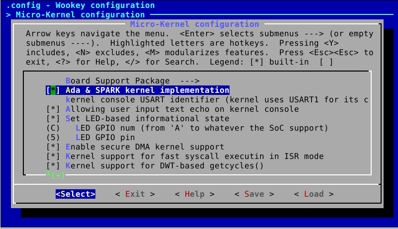
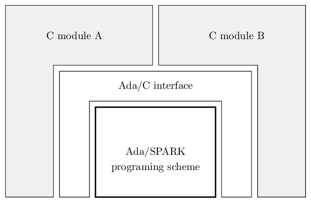
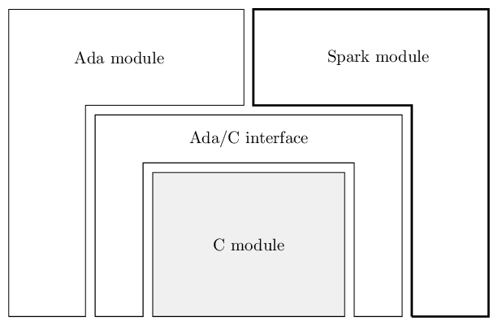

Ada code architecture
=====================

Ewok implementation
-------------------

The EwoK microkernel is an hybrid C/Ada kernel. It can be compiled as a
full-C kernel or as a better certified C/Ada/SPARK microkernel using
a single configuration option in the Tataouine SDK menuconfig.

When activating this option, the following elements are setup:

   * For the kernel sources:

      * a complete libada for the kernel (named libkernel) is built, using all Ada packages in the kernel/Ada directory
      * all C files named <module>.c in kernel/ directory for which an Ada file named 'ewok-<module>.adb' exists in kernel/Ada directory are removed from the list of compiled C files
   * For the libbsp

      * a complete Ada bsp lib (named libabsp) is build, using all Ada packages in arch/ directory
      * all C files named <module>.c in various arch directories for which an Ada file named 'arch-<module>.adb' exists in the Ada directory of the same place are removed from the list of compiled C files
   * libkernel and libabsp are linked together. As it is still a full Ada code, SPARK checks and Ada type checking between the two libraries are still operational
   * The residual C code of arch/ is linked into a smaller libbsp
   * The residual C code of the kernel is compiled to generate the remaining C object files
   * Everything is linked into one single ELF binary, symbols are resolved and C and Ada code can call each-other

.. highlight:: make

Deleting the C equivalent of Ada files is done in various Makefiles using the same GNU Make code::

   # deleting C files having their Ada equivalent from the C/obj list
   ADACEQ = $(patsubst Ada/ewok-%.adb,%.c,$(ASRC))
   SRC_TMP = $(filter-out $(ADACEQ),$(SRC))
   SRC := $(SRC_TMP)
   OBJ := $(patsubst %.c,$(APP_BUILD_DIR)/%.o,$(SRC))

All the autonomous Ada implementations help to guarantee higher safety and security thanks to the Ada language properties. However, all the interactions with the residual C code loose these properties,
this is why such interactions between C and Ada are kept to a minimum.

From C to Ada paradigm
----------------------

Development paradigms between Ada and C may be quite different. To allow an implementation of interchangeable Ada and C modules, Ada modules are decomposed in two main blocks:

   * A small interface design pattern which helps to abstract the Ada part of the module and serves the same API as the equivalent C module

       * This interface has nearly no intelligence at all and export all its types, functions and procedures to C code
   * The Ada module itself, which is free to use an Ada-oriented paradigm

The EwoK kernel supports a dual implementation (C & Ada). Each module Ada/Spark implementation replaces the C implementation in the Ada version of the kernel.
The Ada/Spark port with API compatible support of each module has been done progressively, by integrating the first Ada/Spark modules as exceptions, then
reducing the C interface to the residual C modules only.

*initial Ada/Spark integration*

*Finalization of Ada/Spark integration*

Importing C symbols
"""""""""""""""""""

.. highlight:: vhdl

Importing a C symbol in an Ada program is done using the following directive::

   function my_ada_function ( myarg : unsigned_8) return unsigned_32
   with
      convention     => c,
      import         => true,
      external_name  => "my_c_function",
      global         => null;

Using this directive, the symbol resolved by ``my_c_function`` in the C object
file can be used using ``my_ada_function`` in the Ada implementation.

When importing a C function, it is required to comply with less restrictive
types such as unsigned_32, unsigned_8 or bit-length boolean (Ada booleans
are bigger types).

To do so, writing a C types specification for Ada is highly recommended.
EwoK keeps its C types for Ada in the Ada types.c unit of the libbsp.

As using C symbols makes Ada strict typing and SPARK inefficient, their usage
must be reduced to a **small and controlled subset of the Ada code**.

In the EwoK case, using C symbols is reduced to the Ada/C interface unit only.
This interface has no algorithmic intelligence but must take care of the
overtyped C arguments when using C symbols.

.. highlight:: c

A typical usage would be, for the following C code::

   uint8_t nvic_get_pending_irq()
   {
      ... // return the IRQ number as an uint8_t
    }

.. highlight:: vhdl

An Ada interface that could look like the following::

   with ada.unchecked_conversion;
   pragma warnings (off);
   function to_t_interrupt is new ada.unchecked_conversion
      (unsigned_8, t_interrupt);
   pragma warnings (on);

   -- t_interrupt is an Ada type listing only the effective existing
   -- IRQs (IRQ 1 to IRQ 96 for e.g.)
   function get_interrupt(irq : out t_interrupt)
   is
     local_irq : unsigned_8;
   begin
       local_irq := nvic_get_pending_irq();
       if local_irq in t_interrupt'range then
          irq = to_t_interrupt(local_irq);
       else
          -- raise exception or react in any way
       end if;
   end

Exporting Ada symbols to C
""""""""""""""""""""""""""

Exporting Ada symbols to C is done using the same philosophy::

   -- initialize the DWT module
   -- This procedure is called by the kernel main() function, and as
   -- a consequence exported to C
   procedure init
    with
      convention => c,
      export => true,
      external_name => "soc_dwt_init";

Nevertheless, there are some cases that require extra care and attention: 
**when specific types are handled differently in Ada and C**.
This is the case of strings, which are more complex and **not**
null-terminated in Ada, or boolean, which are encoded on 8-bits fields.

To solve such an issue, we define for the Ada code some C-compatible
types. Here is an example of a C compatible boolean implementation::

   type bool is new boolean with size => 1;
   for bool use (true => 1, false => 0);

Ada sources
-----------

EwoK Ada sources are hosted in the following directories:

   * kernel/Ada for the kernel, arch-independent Ada code
   * kernel/Ada/generated hosts the generated Ada files, like kernel/generated
     hosts the generated C files
   * arch-specific Ada content (BSP) is hosted in the Ada subdirectory of each SoC and
     core source directory

Ada has a hierarchical scoping principle, based on packages. In the case of
EwoK, various packages and subpackages are used.

   * kernel pacakges belong to the `ewok` package
   * SoC-related packages belong to the `soc` package
   * Core-related packages belong to the core-relative package (e.g. `m4` for
     Cortex-M4)

As the EwoK kernel is an hybrid C/Ada/SPARK kernel, some packages require
an external interface with the C code. For a given package *foo* interacting
with external C code, a *foo_interface* package must exist.

In the same way, as some various C types (structures, union, enumerates, etc.)
have to be used in the interfaces packages, the following C-specific packages
exist, containing only specifications:

   * c package containing all C types and API that are arch-independent
   * c_soc package, containing all C types and API that are SoC-specific

Preprocessing in Ada
--------------------

Ada does support preprocessing and the configuration options sometime
use the preprocessing principle to enable or not some specific functions.
The preprocessing usage is quite similar to C::

   #if CONFIG_KERNEL_DOMAIN
      function is_same_domain
        (from    : in t_real_task_id;
         to      : in t_real_task_id)
      return boolean
      with
         Global    => null,
         Post      => (if (from = to) then is_same_domain'Result = false);
   #end if;

Generated files
---------------

Generated files are not created by the microkernel internal tools, but by the
SDK. The reason is that the generated files contain information about the
applications list, associated permissions and layout. All these information
are stored by the SDK configuration mechanism, not by the kernel itself.

The scripts generating these files (and the C equivalent) are hosted in the
tools/ directory of the SDK:

   * tools/gen_ld: generates the global layout and the application layout header
   * tools/gen_symhdr.pl: generates the applications section mapping. Used to
     map .data and zeroify .bss of each application at boot time
   * tools/apps/permissions.pl: generates the application permissions header

