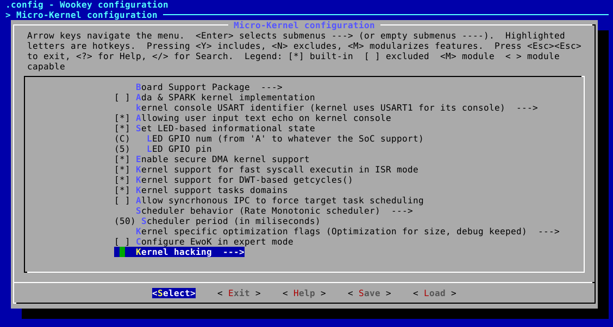
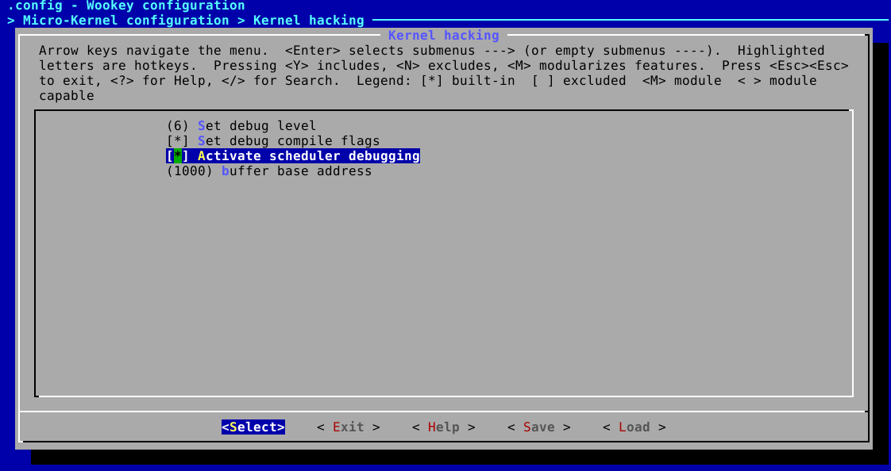

.. _debug_sched:

Debugging EwoK Scheduler
========================

.. contents::

About Ewok schedulers
---------------------

There are several scheduling schemes supported in EwoK:

   * Basic Round-Robin
   * Random scheduler
   * MLQ-RR (Multi-Queue Round-Robin)

All scheduling schemes are constrained by the following:

  * ISR have a greater priority and are executed before regular main threads.

  * Softirqd, which executes asynchronous syscalls and prepares tasks to handle
    ISR, is executed with a greater priority than other tasks, but lower
    priority than ISRs.

  * If neither an ISR nor a syscall is to be executed, the global thread
    scheduling scheme is executed (i.e. Round-Robin, Random or MLQ-RR
    scheme) on all regular threads.

Round-Robin scheduler
^^^^^^^^^^^^^^^^^^^^^

The Round-Robin scheduler schedules each runnable task successively. Each task
can use the core up to the configured task slot time slice. The task is
scheduled if:

   * the task reaches the task slot length
   * an interrupt arises, requiring an ISR execution
   * the task voluntarily yields
   * the task executes an asynchronous syscall (IPC or CFG)

When the scheduler is executed, it selects the next task (starting with the
next id, based on the current task id), and elects the first task which is
runnable.

If no task at all is runnable, the idle task is executed.

Random scheduler
^^^^^^^^^^^^^^^^

The random scheduler is using the hardware RNG to select a task in the task
list. If the task is not runnable, the scheduler gets back another random
number and tries again.

The scheduler tries 32 times before executing the idle task.

This scheduler is mostly an example of basic scheduling scheme.

MLQ-RR scheduler
^^^^^^^^^^^^^^^^

The MLQ-RR scheduler is the only scheduling scheme of EwoK supporting
tasks priorities.
This scheduler is able to schedule tasks based on their priority using the
following rules:

   * The scheduler selects the list of runnable tasks having the highest
     priority
   * If more than one task have the same priority, the scheduler uses a
     round-robin policy on tasks of the same priority

This scheduling is efficient to prioritize tasks with high idle periods and
short (but requiring high reactivity) runnable periods. The drawback of such
efficiency is that tasks have to voluntarily yield or ask for being idle (for
example by locking on IPC receive) to avoid starvation of lower priority tasks.

Activating the scheduler debug mode
-----------------------------------

The scheduler debug mode can be activated from the kernel menuconfig, in the
'*kernel hacking* menu:

There are two dedicated options in this menu:

   * Activate scheduler debugging
   * Scheduling buffer size

The option *Activate scheduler debugging* activates the following behaviors:

   * Each task holds three counters:
      * the number of normal scheduling
      * the number of ISR scheduling
      * the number of forced scheduling after ISR (see device_t API)
   * the kernel registers the last scheduling information in a ring-buffer

The *Scheduler buffer size* sets the scheduler ring-buffer length. The bigger
the buffer is, the bigger the registered temporal window is. Although, the
buffer is held in the kernel memory, and hence needs to fit in it. Its default
length is 1000 entries.

.. hint::
   Tataouine SDK will help when increasing the buffer size, returning a specific
   error in the kernel data section if it is too big.

Exploiting the scheduler debug mode
-----------------------------------

At any time, it is possible to get back each task's counters. You can dump the
counters of any task you want. Gdb will help you with variable name completion::

   (gdb) print tasks_list[2].count
   $2 = 0x1bf
   (gdb) print tasks_list[2].isr_count
   $3 = 0x41
   (gdb) print tasks_list[2].force_count
   $4 = 0x0

It is also possible to get back the scheduling buffer from gdb, to understand
how tasks are executed.
The scheduling buffer keeps three information:

   * the timestamp (in microseconds, since the processor boot time)
   * the task id (as referenced in include/generated/app_layout.h)
   * the task mode (0x0 is the main thread, 0x1 is an ISR)

Printing the scheduler ring buffer is easy using gdb::

   arm-none-eabi-gdb
   (gdb) target extended-remote localhost:3333
   (gdb) monitor reset halt
   (gdb) c
   ... wait for some time
   ^C
   (gdb) symbol-file build/armv7-m/wookey/kernel/kernel.elf
   (gdb) set print elements 1000
   (gdb) print sched_ring_buffer.buf

You can copy the ring buffer content into a text file and clean it to make it
easily readable::

   sed -i -re 's/}, \{/\n/g' schedbuf.dat

This will delete blocks and generate one scheduling event by line.
Such a scheduling trace will then look like this::

   ts = 0x3ce5c0, id = 0x8, mode = 0x0
   ts = 0x3ce648, id = 0x4, mode = 0x1
   ts = 0x3ce653, id = 0x4, mode = 0x0
   ts = 0x3ce65e, id = 0x8, mode = 0x0
   ts = 0x3ce663, id = 0x8, mode = 0x0
   ts = 0x3ce6e4, id = 0x4, mode = 0x1
   ts = 0x3ce6ef, id = 0x8, mode = 0x0
   ts = 0x3ce6f7, id = 0x4, mode = 0x0
   ts = 0x3ce703, id = 0x8, mode = 0x0
   ts = 0x3ce70c, id = 0x2, mode = 0x0
   ts = 0x3da967, id = 0x4, mode = 0x0
   ts = 0x3da973, id = 0x8, mode = 0x0
   ts = 0x3da97b, id = 0x2, mode = 0x0

It is possible to post-process it in various ways, using graphviz, gnuplot or
any other tools depending on your need.

