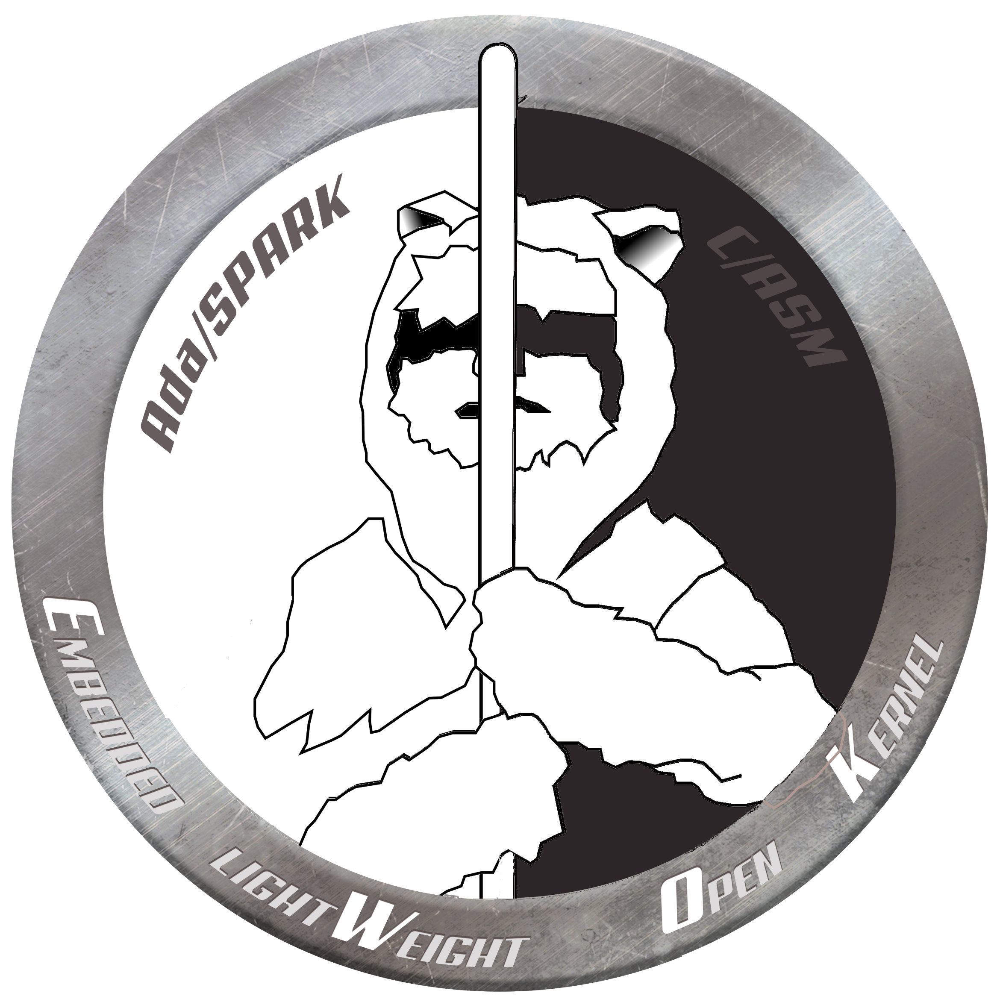
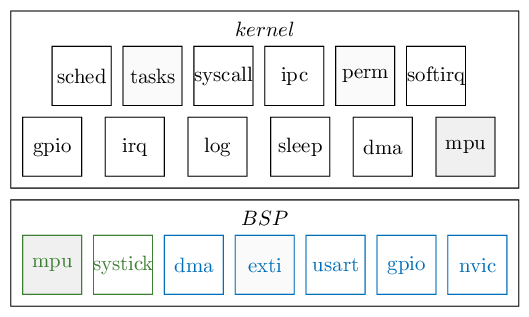
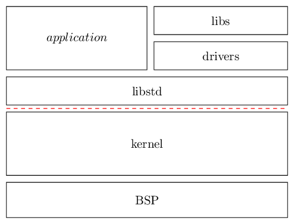

.. _ewok_kernel:

EwoK microkernel
================

.. contents::
   :depth: 2

What is EwoK ?
--------------

EwoK is a microkernel targeting micro-controllers and embedded systems
aiming at building secure and trusted devices.

Drivers are hold in userspace. Unlike most of
other microkernels, the goal is to support complex drivers (ISO7816,
USB, CRYP, SDIO) while achieving high performances.

Security properties
^^^^^^^^^^^^^^^^^^^

EwoK supports the following properties:

   * Strict memory partitioning
   * Strict partitioning of physical resources (devices, etc.)
   * Fixed permissions management, set at compile time and easily verifiable
   * Kernel Random Number Generation support (based on True RNG HW on STM32)
   * Stack smashing protection in both kernel and userspace tasks
   * Userspace Heap smashing defenses
   * Proved W^X memory mappings
   * Strict temporal separation between declarative phase and execution phase

Performances
^^^^^^^^^^^^

Unlike other microkernels, EwoK allows userland drivers to use
DMA, GPIOs and EXTIs with the help of some specific syscalls.
Such interfaces are directly implemented in the kernel, in order to
achieve better performance. Indeed, some hardware need a very
responsive software and such responsiveness can not easily be
achieved in a typically minimalistic microkernel (like the ones from the L4 family).

EwoK architecture
-----------------

Kernel architecture
^^^^^^^^^^^^^^^^^^^

The kernel is divided into two main components: the **libbsp** and the
**kernel** parts.

The *libbsp* is the hardware abstraction layer, hosting all the low level and
arch-specific drivers (MPU, GPIOs, timers, DMAs, etc.).
The *libbsp* is itself separated in two blocks:

   1. *SoC-specific drivers*, such as DMA or GPIO support for the STM32F407 board
   2. *Core-specific drivers*, such as MPU support for the Cortex-M4 ARMv7m
      micro-architecture

The *kernel* part contains all specific high level content (scheduling, task
management, syscalls, etc.) and uses the libbsp as a hardware abstraction for
any low-level interaction.

Drivers
^^^^^^^

The :ref:`lib_std` (*libstd*) is a C standard library that can be used
by the user tasks (and hence the userspace drivers).
Like the *libc* for *UNIX*-like systems, it implements some useful functions.

The **drivers** are written as userspace libraries. They depend on the *libstd*,
and may sometimes depend on each others. Here is the list of the existing
drivers.

**Libraries** bring various userspace features with arch-independent
implementations.

EwoK API
--------

EwoK is tuned for high performance embedded systems.
The whole microkernel architecture and the provided API are
specifically designed for this purpose.
Note that for these specific performance constraints, EwoK
is not a full-IPC driven microkernel, like the L4 family.

The EwoK API is described here:

.. toctree::
   :maxdepth: 1

   Syscalls <syscalls>
   Using devices from userland <devices>
   Permissions <perms>

Internals
---------

.. toctree::
   :maxdepth: 1

   Ada/SPARK implementation <ada_spark>
   EwoK permission internals <perms_internals>
   EwoK IRQ & ISR internals <isr_internals>
   EwoK scheduler internals <debug_sched>

FAQ
---

.. toctree::
   :maxdepth: 1

    General FAQ <faq_general>
    Syscalls FAQ <faq_syscalls>
    Permissions FAQ <faq_perms>
    Security FAQ <faq_security>
    Build process FAQ <faq_build>

