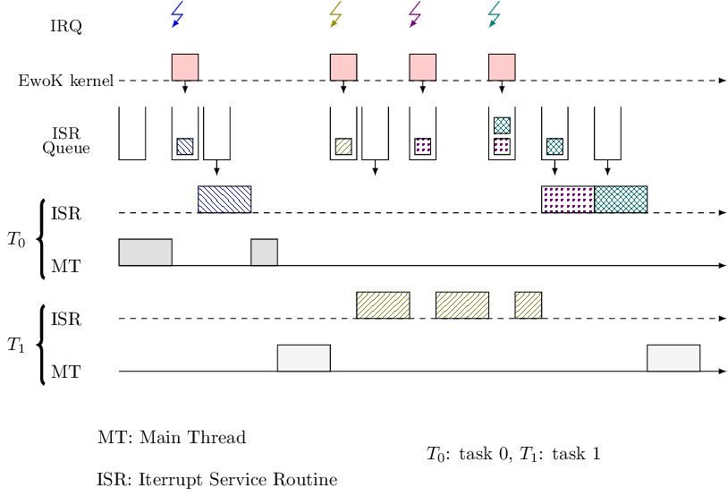

.. _isr_internals:

.. contents::

EwoK IRQ and ISR internals
==========================

ISR mechanism
-------------

Some hardware devices such as the smart card generate interrupts that must be
acknowledged within a very tight time frame to avoid timeouts.  Other
components like the touch screen put pressure on the kernel with interrupts
bursts.
To deal with these constraints, we designed a simple yet effective
system to quickly acknowledge interrupts and to limit as much as possible the
overhead of the user mode drivers.

In EwoK, a driver is typically  composed of a main thread, which implements all
the driver logic, and one or several *Interrupt Service Routine (ISR)* to
handle the hardware interrupts.  ISRs execution takes place in
user mode, with the associated task permissions and memory layout.

Usually, a user ISR performs only two things: it acknowledges the hardware by
reading or writing in some registers and it sets some variables or some shared
structures to signal to the main thread that an event happened.

It should be highlighted that a user ISR is scheduled with the highest
priority. As a consequence, it must be fast enough to avoid hindering
treatment of subsequent hardware interrupts.

ISR postponing
--------------

When a hardware interrupt is triggered, the kernel traps it and checks if it
must be handled by a user task. If this is the case, the kernel updates a queue
structure, managed by the so-called *softirq* module, so that the related user
ISR can be scheduled afterward. If an interrupt is triggered while a user ISR
is already executing, this interrupt is not lost thanks to the *softirq*
queueing mechanism that defers its treatment.

In this design, user ISRs are executed asynchronously.
A potential problem is the induced latency in the handling of hardware interrupts.

Previous figure describes a typical scheduling scheme during an IRQ burst.
The *posthook* mechanism has been introduced to address this issue.

Posthooks
---------

Posthook instructions define a restricted high level language that allows to
read or to set some bits in specific hardware registers when an interrupt
occurs. For each kind of interrupt, a driver can use such posthook
instructions, that are synchronously interpreted and executed by the kernel, in
order to quickly acknowledge hardware interrupts.
