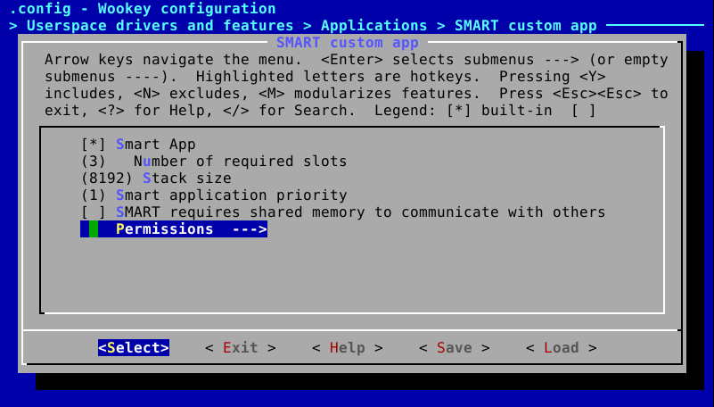
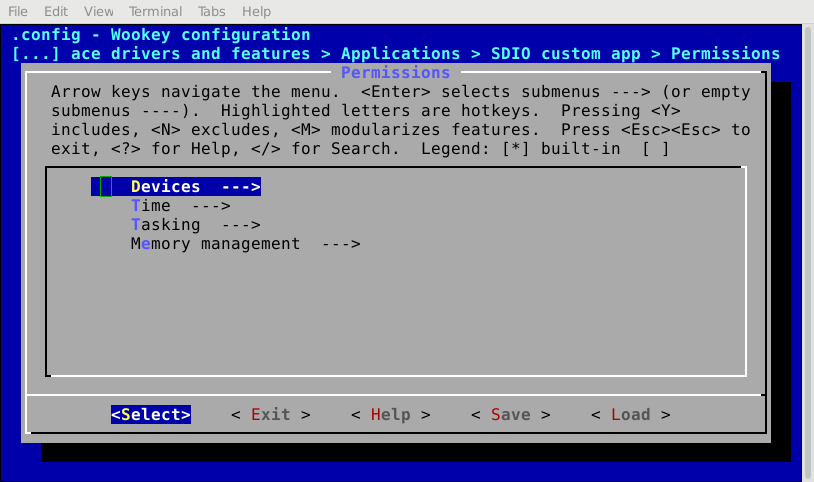
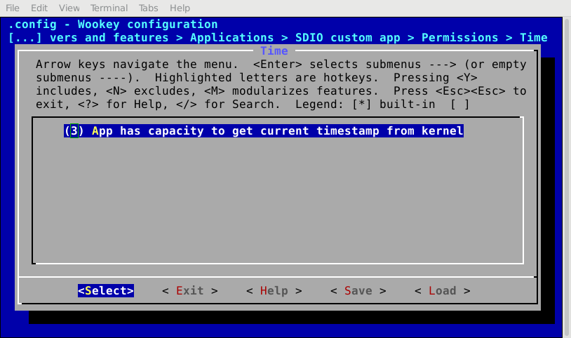
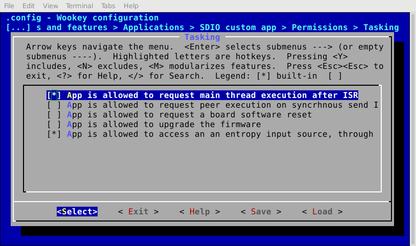
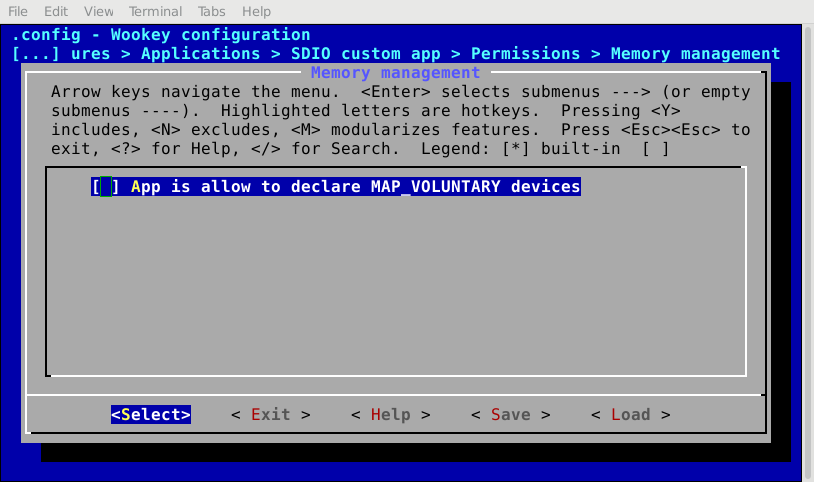
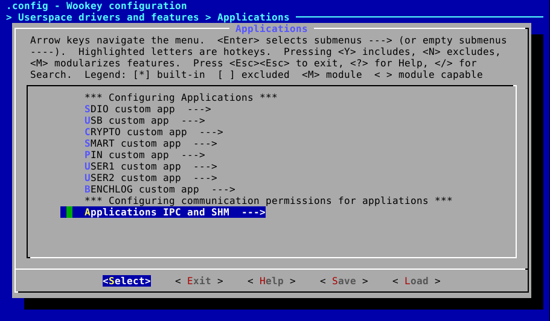
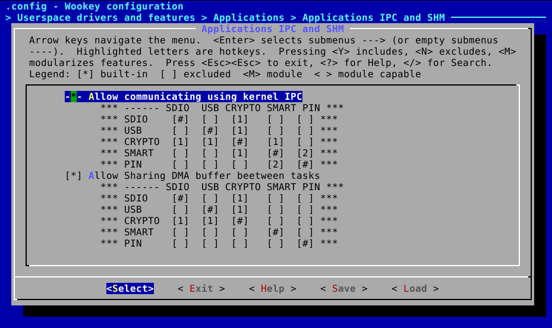

.. _perms:

EwoK permissions
================

.. _ewok-perm:

.. contents::

General principle
-----------------

Permissions are statically set at configuration time,
before building the firmware, and cannot be updated during the device life-cycle.
Each application permission is stored in a *.rodata* part of the kernel,
reducing the risk of any tampering with.

Configuring the permissions
---------------------------

Permissions are configured by using two complementary means:

   * The whole permissions, except IPCs, are set using ``menuconfig``
   * IPCs are configured by editing ``apps/ipc.config`` and
     ``apps/dmashm.config`` files

Menuconfig
^^^^^^^^^^

Each application has its own permissions set by menuconfig:

Permissions are separated into 4 families:
   * Devices
   * Time
   * Tasking
   * Memory management

Devices
"""""""

*Devices* permissions controls the capability to:
   * Use DMA streams
   * Use the hardware cryptographic module
   * Use buses (SPI, I2C, etc.)
   * Use EXTIs
   * Use a hardware timer

.. image:: img/mc_app_perms_devices.png
   :alt: Task permissions configuration
   :align: center

.. warning::
   Devices permissions impact the ``sys_init(INIT_DEVACCESS)`` syscall
   
Time
""""

*Time* controls the capability to use the kernel internal clock:

This option allows to specify the granted granularity of the timestamp
returned by the kernel:

   * No time measurement is possible
   * Tick granularity
   * Microsecond granularity
   * CPU cycle granularity

.. warning::
   Time permissions impact the ``sys_get_systick()`` syscall

Tasking
"""""""

*Tasking* controls the capability to:
   * When an ISR exit, its main thread is scheduled, bypassing the default
     scheduling policy. This is needed by devices requiring a high
     responsiveness (e.g. smart cards over IS7816-3 buses)
   * When the task sends an IPC, if the target task is idle or runnable, it is
     immediately scheduled, bypassing the scheduling policy
   * Reset the board
   * Upgrade the firmware
   * Access to randomness generated by the kernel (and relying on the hardware
     RNG)

.. warning::
   Devices permissions impact the ``sys_init(INIT_DEVACCESS)`` and ``sys_reset()`` syscalls

Memory management
"""""""""""""""""

*Memory management* controls the capability to voluntary map or unmap a
device in the task's address space.

This does not permit to declare a new device, but only to temporary (un)map it
from the task's address space, if the driver supports this feature.

.. warning::
   Devices permissions impact the ``sys_init(INIT_DEVACCESS)`` syscall

IPCs
^^^^

Communication permissions are based on two arrays, found in plain-text files:

   * The array in ``apps/ipc.config`` is used to set the permissions for 
     using the IPC mechanism
   * The array in ``apps/dmashm.config`` is used to set the permissions for
     using the DMA shared memory mechanism

IPC array is in ``apps/ipc.config``. The sender is on the left column. Setting
``1`` in a box means that the task on the left is able to send a message
using IPCs to the one above: ::

   comment "------ SDIO  USB CRYPTO SMART PIN"
   comment "SDIO    [#]  [1]  [ ]   [ ]  [ ]"
   comment "USB     [ ]  [#]  [ ]   [ ]  [ ]"
   comment "CRYPTO  [ ]  [ ]  [#]   [ ]  [ ]"
   comment "SMART   [ ]  [ ]  [ ]   [#]  [ ]"
   comment "PIN     [ ]  [ ]  [ ]   [ ]  [#]"

.. warning::
   A task is not allowed to send IPC to itself

DMA shared memory array is in ``apps/dmashm.config``. The "caller" is
on the left column. A mark in a box means that the task on the left (the
"caller") is able to share a buffer with another task (the "granted"). The task
selected on the right columns are granted to use a buffer in "caller" address
space for DMA transfers: ::

   comment "------ SDIO  USB CRYPTO SMART PIN"
   comment "SDIO    [#]  [ ]  [ ]   [ ]  [ ]"
   comment "USB     [ ]  [#]  [ ]   [ ]  [ ]"
   comment "CRYPTO  [ ]  [ ]  [#]   [ ]  [ ]"
   comment "SMART   [ ]  [ ]  [ ]   [#]  [ ]"
   comment "PIN     [ ]  [ ]  [ ]   [ ]  [#]"

Note that menuconfig displays those arrays, but without the possibility to
modify them: you will have to edit the associated files manually.

.. warning::
   A task is not allowed to delcare DMA SHM to itself

