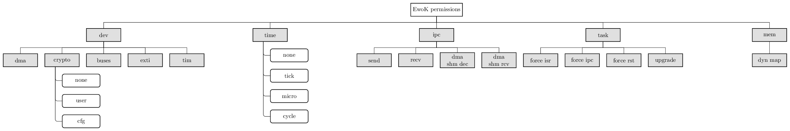
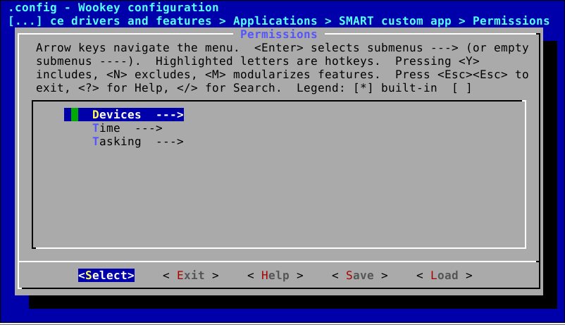
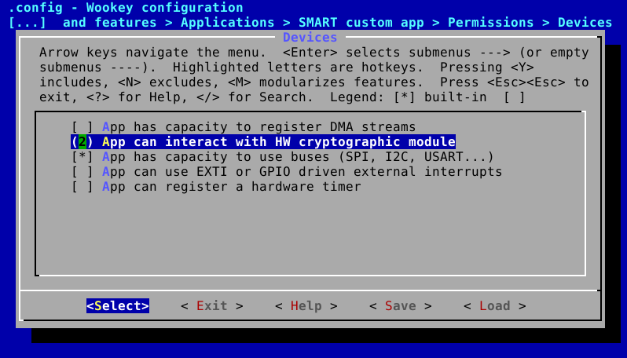

About EwoK permissions model
============================

.. _ewok-perm:

.. contents::

General principle
-----------------

EwoK permission model is static. Permissions are set at configuration time,
before building the firmware, and can't be updated during the device life cycle.
Each application permissions are stored in a .rodata part of the kernel,
reducing the risk of any invalid modification.

As EwoK is a driver-oriented microkernel, permissions are also driver oriented.

Global permissions hierarchy
----------------------------

There are four main permissions families:

   * **dev**, defining device access permissions management
   * **time**, defining time access permission management
   * **ipc**, defining the ability to execute IPC
   * **tasking**, defining the ability to consume CPU slots and require schedule time
   * **memory**, defining the ability to map and unmap ressources into memory

*dev*, *time*, *tasking* and *memory* are called **resource permissions** as they require access to a specific IP (CPU core, a given device, etc.)
*ipc* are called **communication permissions**, as they require a peer to
communicate with.

Device permissions
^^^^^^^^^^^^^^^^^^

Before accessing any device, the device block permission has to be allowed.
If yes, device children can be requested.

There are various permissions associated to devices. These permissions are
associated to the impact of the concerned device in terms of:

   * Security asset access
   * DoS (Denial of Service) risk
   * Capacity to exfiltrate data

The device family permissions is the following:

   * dma, permission dedicated to DMA controller access
   * crypto, permission dedicated to hardware cryptographic IP. This permission is an enumeration in order to separate:

      * cryptographic IP usage (ciphering/deciphering)
      * cryptographic IP configuration (cryptographic keys injection)

   * bus, permission dedicated to buses access (I2C, SPI, USB, USART)
   * exti, permission dedicated to external interrupts usage

Time permissions
^^^^^^^^^^^^^^^^

The time permission is an enumeration, specifying the level of time precision access:

   * no time measurement
   * tick level time measurement
   * microsecond level time measurement
   * cycle level time measurement

Tasking permissions
^^^^^^^^^^^^^^^^^^^

The tasking family permissions manages the task behavior. The tasking permissions are the following:

   * force ISR (FISR): the task ISR can force the execution of the main thread just after its own execution. This is needed for high reactivity devices or devices without flow control such as smartcards over IS7816-3 buses
   * force IPC (FIPC): when the task sends an IPC, if the target task is idle or runnable, it is immediately executed. This decreases the overall latency when a data flow is based on successive tasks using IPCs as a control channel
   * Execute board reset (RESET): the task is able to request an immediate SoC reset

Memory permissions
^^^^^^^^^^^^^^^^^^

The memory family permissions manages the task ability to modify its own memory space. The memory permissions only allows the task to modify the mapping
of previously declared and allowed resources.

   * Dynamic mapping (DYNAMIC_MAP): the task can map and unmap devices that have previously been declared with a specific map mode: DEV_MAP_VOLUNTARY. Mapping and unmapping a device has neither an effect on its attributes (address, size, registers state) nor on other associated components (NVIC, RCC). Only the task main thread memory map is affected.

IPC permissions
^^^^^^^^^^^^^^^

The ipc family permissions, if allowed, is separated in different independent permissions:

   * send, allowing to send IPC to another task
   * recv, allowing to receive IPC from another task
   * dma shm (SHD): allows a task to share a buffer with another task to let it use this buffer as a DMA stream source or destination
   * dma shm recv (RCD): allows a task to be a target of a dma shm sharing from another task

By now, all tasks are allowed to use the ``sys_ipc(IPC_LOG)`` IPC, whose peer
is the kernel USART manager.

Inter-process communication are a specific case as they require two tasks permissions interacting independently.
Communication permission can't be formalized using a basic register, but requires a communication matrix,
declaring which task can communicate with which other tasks.

This is done with such a typical example:

+--+--+--+--+
|  |T1|T2|T3|
+--+--+--+--+
|T1|xx|1 |0 |
+--+--+--+--+
|T2|1 |xx|1 |
+--+--+--+--+
|T3|0 |0 |xx|
+--+--+--+--+

Such a table allows the following IPCs:

Reading each line:

   * T1 can send messages to T2 only.
   * T2 can send messages to T1 and T3.
   * T3 can't send message to anyone.

Reading each column:

   * T1 can receive message from T2.
   * T2 can receive message from T1.
   * T3 can receive message from T2.

Communication permissions, like others, are declared at configuration time, which means that a task can't require
new communication permissions at run time.

.. hint::
   Such a matrix also makes it easier to detect cycles and security risks due to IPC associativity at build time

Declaring a DMA shared memory buffer is also considered as an inter-process communication. The DMA SHM permissions are
managed by another matrix, using the same paradigm as the previous one. In this case, the sender is the emitter of the
DMA SHM and the receiver is the peer which will be able to use the SHM as source or destination of a DMA transaction.

Configuring the permissions
---------------------------

Permission are configured using two interfaces:
   * resources permissions (i.e. device access, time access and tasking) are configured using task's menuconfig
   * communication permissions (IPC, DMA SHM access) are configured using a text file

Configuring the resources permissions
^^^^^^^^^^^^^^^^^^^^^^^^^^^^^^^^^^^^^^

Each application has its own list of permissions. The resources permissions are set using the menuconfig of the corresponding task:

.. image:: img/mc_perm.png
   :alt: Task permissions
   :align: center

Resources permissions are separated into the same families as the ones defined above:

All permissions based on booleans are managed as booleans in the menuconfig. Enumerates (such as getcycles management, Hardware CRYP access, etc.) are managed using integer ranges. All permissions have complete help menu with the menuconfig to help with the configuration.

.. warning::
   Take a great care when declaring permissions. By default, tasks have no permission at all and you need to activate each of them using the configuration menu.

Configuring the communication permissions
^^^^^^^^^^^^^^^^^^^^^^^^^^^^^^^^^^^^^^^^^

Communication permissions are based on two matrices:

   * An IPC matrix, managing the IPC transactions
   * A DMA SHM matrix, managing the declarations of DMA shared memory buffers

The configuration is done in plain-text files, as Kconfig frontend is not made for such configuration mechanism.
Nonetheless, the menuconfig show the matrix content to help with IPC or DMA SHM error resolution.

IPC matrix is hosted in ``apps/ipc.config`` file::

   # This is the IPC matrix, defining the task IPC
   # permissions for current tasks. You can set it
   # using the following:
   # - ipc send are read line by line, sender at left
   # - ipc recv are read column by column, receiver at top
   # - if the value of a cell is set to 1, IPC is allowed
   # - any other value means that the share is not allowed
   #
   # This matrix is converted into a static const matrix in
   # C and Ada defining the permissions of all tasks
   #

   comment "------ SDIO  USB CRYPTO SMART PIN"
   comment "SDIO    [#]  [ ]  [ ]   [ ]  [ ]"
   comment "USB     [ ]  [#]  [ ]   [ ]  [ ]"
   comment "CRYPTO  [ ]  [ ]  [#]   [ ]  [ ]"
   comment "SMART   [ ]  [ ]  [ ]   [#]  [ ]"
   comment "PIN     [ ]  [ ]  [ ]   [ ]  [#]"

DMA SHM matrix is hosted in ``apps/dmashm.config`` file::

   # This is the DMA SHM matrix, defining the task DMA SHM declaration
   # permissions for current tasks. You can set it
   # using the following:
   # - DMA SHM declaration are read line by line, emiter at left
   # - DMA SHM peer are read column by column, peer at top
   # - if the value of a cell is set to 1, the share is allowed
   # - any other value means that the share is not allowed
   #
   # This matrix is converted into a static const matrix in
   # C and Ada defining the permissions of all tasks
   #

   comment "------ SDIO  USB CRYPTO SMART PIN"
   comment "SDIO    [#]  [ ]  [ ]   [ ]  [ ]"
   comment "USB     [ ]  [#]  [ ]   [ ]  [ ]"
   comment "CRYPTO  [ ]  [ ]  [#]   [ ]  [ ]"
   comment "SMART   [ ]  [ ]  [ ]   [#]  [ ]"
   comment "PIN     [ ]  [ ]  [ ]   [ ]  [#]"

.. warning::
   There is no difference in term of permissions between IPC with empty buffers and
   IPC with buffers. As some tasks may only require SYN/ACK mechanism (no buffer),
   such a difference in the permissions management might be interesting.
   With no buffer allowed, it's harder to transmit invalid data. However, it is not impossible
   (thanks to time base covert channels, etc.)

These files can be filled using the above canvas and respecting the associated documentation.
When using the Tataouine menuconfig, the two matrices will be printed out in the Applications menu:

.. image:: img/mc_com_perm.png
   :alt: communication permissions menu
   :align: center

.. image:: img/mc_com_perm_matrices.png
   :alt: communication permissions matrices
   :align: center

