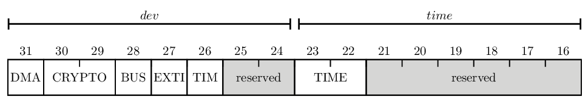
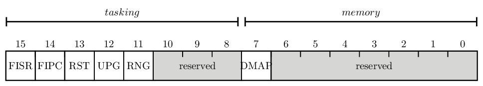

.. _perms_internals:

About EwoK permissions internals
================================

.. highlight:: c

EwoK permissions kernel API
---------------------------

Inside the kernel, the permission module exposes a very simple API, in order
to support permission management modularity. This permits, in a future work,
to add various permission models using the same API to other parts of the kernel.

The permission API defines a list of resource names:

+-------------------------+-----------------------------------------------------------------------+
| Permission name         | Description                                                           |
+=========================+=======================================================================+
| PERM_RES_DEV_DMA        | access to DMA devices                                                 |
+-------------------------+-----------------------------------------------------------------------+
| PERM_RES_DEV_CRYPTO_USR | user access to hardware cryptographic devices                         |
+-------------------------+-----------------------------------------------------------------------+
| PERM_RES_DEV_CRYPTO_CFG | full access to hardware cryptographic devices (key injection granted) |
+-------------------------+-----------------------------------------------------------------------+
| PERM_RES_DEV_BUSES      | access to buses (USART, I2C, SPI...)                                  |
+-------------------------+-----------------------------------------------------------------------+
| PERM_RES_DEV_EXTI       | access to external interrupts                                         |
+-------------------------+-----------------------------------------------------------------------+
| PERM_RES_DEV_TIM        | access to timers                                                      |
+-------------------------+-----------------------------------------------------------------------+
| PERM_RES_TIM_GETMILLI   | access to timestamp with tick precision                               |
+-------------------------+-----------------------------------------------------------------------+
| PERM_RES_TIM_GETMICRO   | access to timestamp with microsecond precision                        |
+-------------------------+-----------------------------------------------------------------------+
| PERM_RES_TIM_GETCYCLE   | access to timestamp with CPU cycle precision                          |
+-------------------------+-----------------------------------------------------------------------+
| PERM_RES_TSK_FISR       | task's ISRs are able to require main thread immediate execution       |
+-------------------------+-----------------------------------------------------------------------+
| PERM_RES_TSK_FIPC       | task's IPC send is able to require target thread immediate execution  |
+-------------------------+-----------------------------------------------------------------------+
| PERM_RES_TSK_RESET      | task is able to request immediate SoC reset                           |
+-------------------------+-----------------------------------------------------------------------+
| PERM_RES_TSK_UPGRADE    | task is able to upgrade the firmware (i.e. map the internal flash)    |
+-------------------------+-----------------------------------------------------------------------+
| PERM_RES_TSK_RNG        | task is able to request random data from the kernel RNG source        |
+-------------------------+-----------------------------------------------------------------------+
| PERM_RES_MEM_DYNAMIC_MAP| task is able to (un)map its own devices declared as voluntary mapped  |
+-------------------------+-----------------------------------------------------------------------+

Resource names are define using the preprocessor in C, mapped as an uint32_t.
In Ada, the permission name has its own type.

The permission API also exports the following prototypes::

   bool perm_ipc_is_granted(e_task_id from,
                            e_task_id to);

   bool perm_ressource_is_granted(uint32_t  ressource_name,
                                  task_t*   task);

   bool perm_same_ipc_domain(e_task_id      src,
                             e_task_id      dst);

Through this API, it is possible to control all accesses to resources and
tasks. This API abstracts the permission memory model described below.

Memory representation of permissions in EwoK
--------------------------------------------

As shown in :ref:`Ewok permissions API <ewok-perm>`, permissions are based on a
tree hierarchy.

Permissions are split into two main categories:

   * resources access permissions
   * communication access permissions

Resource access permissions memory model
^^^^^^^^^^^^^^^^^^^^^^^^^^^^^^^^^^^^^^^^

Resource access permissions correspond to all permissions associated to an
access to a hardware resource (core timeslot, device, current cycle count,
etc.).

In order to optimize resources access permissions check at runtime, they are
mapped as a *resource permission register*, for each application.  This
resource permission register works the same way as any hardware register,
with bit fields and masks.

The C implementation of such permissions check is not easy as C does not easily manage
bitfields, but Ada is clearly more efficient for such checks.

The resource permission register is 32-bit long and has the following mapping:

Checking permissions at run time is done using masks, which allows to optimize
permission check time and use boolean constructions.

Booleans are directly mapped as a register bit. Enumerate respects the following
structure:

Time permission mapping (2 bits):

   * 0b00 : none
   * 0b01 : tick permission
   * 0b10 : microsecond permission
   * 0b11 : cycle permission

Cryptographic IP access mapping (2 bits)

   * 0b00 : no access
   * 0b01 : data plane access (no key injection)
   * 0b10 : configuration access (key injection, RNG access)
   * 0b11 : both accesses

The permission register is based on each application permission declaration in
the configuration of the Tataouine SDK. The register is created by Tataouine in
include/generated/app_layout.h (for C code) and in
include/generated/Ada/app_layout.ads (for Ada code).

The permission register is generated as a static const array of bits denoted
0b110010011100...0001110000 in a dedicated resource permission table in
include/generated/gen_perms.h by tools/apps/permissions.pl script.

The kernel perm.c/perm.h (for C) and perm.adb/perm.ads file manage the
permission register read and return the task permissions based on it.

Communication access permissions memory model
^^^^^^^^^^^^^^^^^^^^^^^^^^^^^^^^^^^^^^^^^^^^^

Communications permissions are based on two matrices:

   * An IPC matrix, defining which task is able to communicate with which
     through IPC calls
   * A DMA SHM matrix, defining which task is able to share a DMA buffer with
     which peer

These matrices are generated in include/generated/gen_perms.h by
tools/apps/permissions.pl script.

Here is a typical gen_perms.h content::

   /* ressource register */
   typedef uint32_t ressource_reg_t;

   static const ressource_reg_t ressource_perm_tab[] = {
       0x10000000, /* benchlog */
       0xc000a000, /* crypto */
       0x90000000, /* pin */
       0x94000000, /* sdio */
       0x50008000, /* smart */
       0x90000000, /* usb */
   };

   /* ipc communication permissions */
   static const bool com_ipc_perm[][6] = {
       {0, 0, 0, 0, 0, 0},
       {0, 0, 0, 1, 1, 1},
       {0, 0, 0, 0, 1, 0},
       {0, 1, 0, 0, 0, 0},
       {0, 1, 1, 0, 0, 0},
       {0, 1, 0, 0, 0, 0}
   };

   /* dmashm communication permissions */
   static const bool com_dmashm_perm[][6] = {
       {0, 0, 0, 0, 0, 0},
       {0, 0, 0, 1, 0, 1},
       {0, 0, 0, 0, 0, 0},
       {0, 1, 0, 0, 0, 0},
       {0, 0, 0, 0, 0, 0},
       {0, 1, 0, 0, 0, 0}
   };

The Ada implementation of the permissions is using a strictly typed register
instead of a uint32_t bitfield for the resources permissions register.
The Ada implementation of EwoK is also using SPARK in order to validate its data
flow.

.. highlight:: ada

Here is the generated Ada specification ::

   package ewok.perm_auto
      with spark_mode => on
   is

      -- ressource register definition
      type t_ressource_reg is record
         DEV_DMA         : bit;
         DEV_CRYPTO      : bits_2;
         DEV_BUS         : bit;
         DEV_EXTI        : bit;
         DEV_TIM         : bit;
         DEV_reserved    : bits_2;
         TIM_TIME        : bits_2;
         TIM_reserved    : bits_6;
         TSK_FISR        : bit;
         TSK_FIPC        : bit;
         TSK_RESET       : bit;
         TSK_UPGRADE     : bit;
         TSK_RANDOM      : bit;
         TSK_reserved    : bits_3;
         MEM_DYNAMIC_MAP : bit;
         MEM_reserved    : bits_7;
      end record
         with Size => 32;

      for t_ressource_reg use record
         DEV_DMA         at 0 range 31 .. 31;
         DEV_CRYPTO      at 0 range 29 .. 30;
         DEV_BUS         at 0 range 28 .. 28;
         DEV_EXTI        at 0 range 27 .. 27;
         DEV_TIM         at 0 range 26 .. 26;
         DEV_reserved    at 0 range 24 .. 25;
         TIM_TIME        at 0 range 22 .. 23;
         TIM_reserved    at 0 range 16 .. 21;
         TSK_FISR        at 0 range 15 .. 15;
         TSK_FIPC        at 0 range 14 .. 14;
         TSK_RESET       at 0 range 13 .. 13;
         TSK_UPGRADE     at 0 range 12 .. 12;
         TSK_RANDOM      at 0 range 11 .. 11;
         TSK_reserved    at 0 range  8 .. 10;
         MEM_DYNAMIC_MAP at 0 range  7 .. 7;
         MEM_reserved    at 0 range  0 .. 6;
      end record;

      type t_com_matrix is
        array (t_real_task_id'range, t_real_task_id'range) of Boolean;

      ressource_perm_register_tab : array (t_real_task_id'range) of t_ressource_reg :=
         (
          -- ressource_perm_register for CRYPTO
          ID_APP1 => (
           DEV_DMA        => 1,
           DEV_CRYPTO     => 1,
           DEV_BUS        => 0,
           DEV_EXTI       => 0,
           DEV_TIM        => 0,
           DEV_reserved   => 0,
           TIM_TIME       => 2,
           TIM_reserved   => 0,
           TSK_FISR       => 1,
           TSK_FIPC       => 0,
           TSK_RESET      => 0,
           TSK_UPGRADE    => 0,
           TSK_RANDOM     => 0,
           TSK_reserved   => 0,
           MEM_DYNAMIC_MAP => 0,
           MEM_reserved   => 0),
          -- ressource_perm_register for PIN
          ID_APP2 => (
           DEV_DMA        => 1,
           DEV_CRYPTO     => 0,
           DEV_BUS        => 1,
           DEV_EXTI       => 0,
           DEV_TIM        => 0,
           DEV_reserved   => 0,
           TIM_TIME       => 1,
           TIM_reserved   => 0,
           TSK_FISR       => 0,
           TSK_FIPC       => 0,
           TSK_RESET       => 0,
           TSK_UPGRADE       => 0,
           TSK_RANDOM     => 1,
           TSK_reserved   => 0,
           MEM_DYNAMIC_MAP => 0,
           MEM_reserved   => 0),
          -- ressource_perm_register for SDIO
          ID_APP3 => (
           DEV_DMA        => 1,
           DEV_CRYPTO     => 0,
           DEV_BUS        => 1,
           DEV_EXTI       => 0,
           DEV_TIM        => 1,
           DEV_reserved   => 0,
           TIM_TIME       => 3,
           TIM_reserved   => 0,
           TSK_FISR       => 1,
           TSK_FIPC       => 0,
           TSK_RESET       => 0,
           TSK_UPGRADE       => 0,
           TSK_RANDOM     => 0,
           TSK_reserved   => 0,
           MEM_DYNAMIC_MAP => 0,
           MEM_reserved   => 0),
          -- ressource_perm_register for SMART
          ID_APP4 => (
           DEV_DMA        => 1,
           DEV_CRYPTO     => 2,
           DEV_BUS        => 1,
           DEV_EXTI       => 1,
           DEV_TIM        => 0,
           DEV_reserved   => 0,
           TIM_TIME       => 3,
           TIM_reserved   => 0,
           TSK_FISR       => 1,
           TSK_FIPC       => 0,
           TSK_RESET       => 1,
           TSK_UPGRADE       => 0,
           TSK_RANDOM     => 1,
           TSK_reserved   => 0,
           MEM_DYNAMIC_MAP => 0,
           MEM_reserved   => 0),
          -- ressource_perm_register for USB
          ID_APP5 => (
           DEV_DMA        => 1,
           DEV_CRYPTO     => 0,
           DEV_BUS        => 1,
           DEV_EXTI       => 0,
           DEV_TIM        => 0,
           DEV_reserved   => 0,
           TIM_TIME       => 3,
           TIM_reserved   => 0,
           TSK_FISR       => 1,
           TSK_FIPC       => 0,
           TSK_RESET       => 0,
           TSK_UPGRADE       => 0,
           TSK_RANDOM     => 0,
           TSK_reserved   => 0,
           MEM_DYNAMIC_MAP => 0,
           MEM_reserved   => 0));

      CRYPTO : constant t_real_task_id := ID_APP1;
      PIN : constant t_real_task_id := ID_APP2;
      SDIO : constant t_real_task_id := ID_APP3;
      SMART : constant t_real_task_id := ID_APP4;
      USB : constant t_real_task_id := ID_APP5;

      -- ipc communication permissions
      com_ipc_perm : constant t_com_matrix :=
         (CRYPTO	=> (ID_APP1 => false, ID_APP2 => false, ID_APP3 => true,  ID_APP4 => true,  ID_APP5 => true),
          PIN	=> (ID_APP1 => false, ID_APP2 => false, ID_APP3 => false, ID_APP4 => true,  ID_APP5 => false),
          SDIO	=> (ID_APP1 => true,  ID_APP2 => false, ID_APP3 => false, ID_APP4 => false, ID_APP5 => false),
          SMART	=> (ID_APP1 => true,  ID_APP2 => true,  ID_APP3 => false, ID_APP4 => false, ID_APP5 => false),
          USB	=> (ID_APP1 => true,  ID_APP2 => false, ID_APP3 => false, ID_APP4 => false, ID_APP5 => false));

      -- dmashm communication permissions
      com_dmashm_perm : constant t_com_matrix :=
         (CRYPTO	=> (ID_APP1 => false, ID_APP2 => false, ID_APP3 => true,  ID_APP4 => false, ID_APP5 => true),
          PIN	=> (ID_APP1 => false, ID_APP2 => false, ID_APP3 => false, ID_APP4 => false, ID_APP5 => false),
          SDIO	=> (ID_APP1 => true,  ID_APP2 => false, ID_APP3 => false, ID_APP4 => false, ID_APP5 => false),
          SMART	=> (ID_APP1 => false, ID_APP2 => false, ID_APP3 => false, ID_APP4 => false, ID_APP5 => false),
          USB	=> (ID_APP1 => true,  ID_APP2 => false, ID_APP3 => false, ID_APP4 => false, ID_APP5 => false));

   end ewok.perm_auto;

